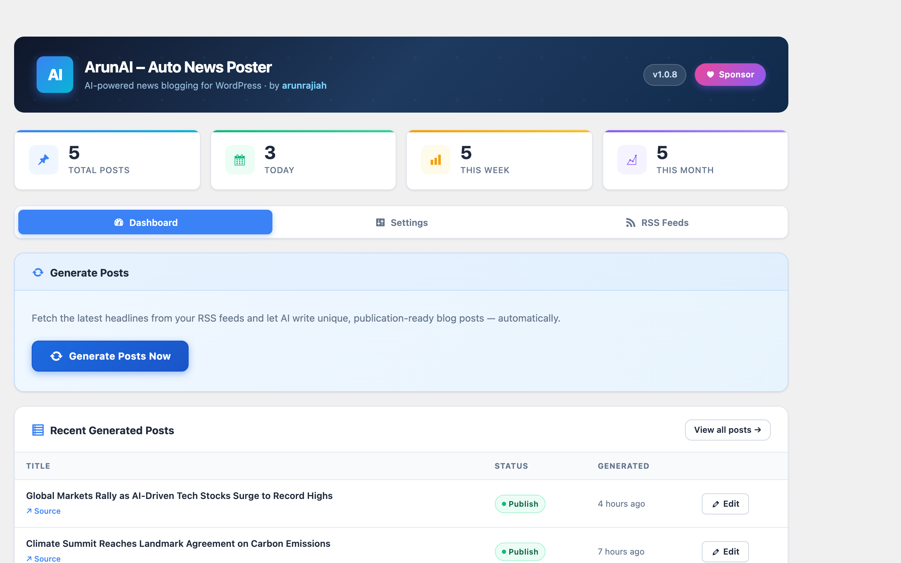
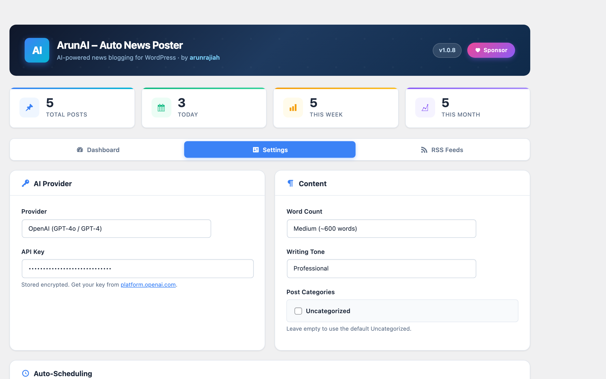
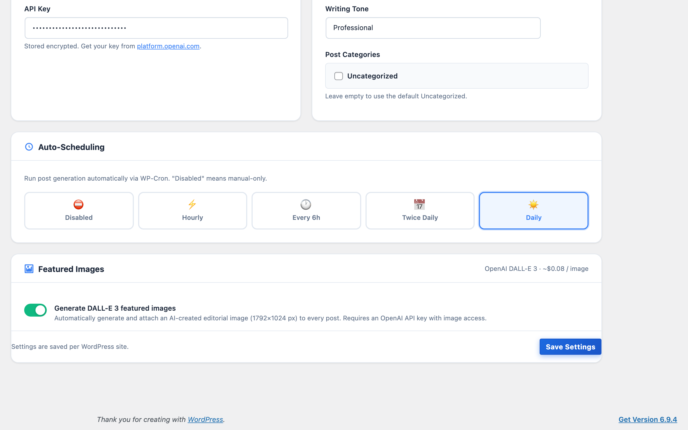
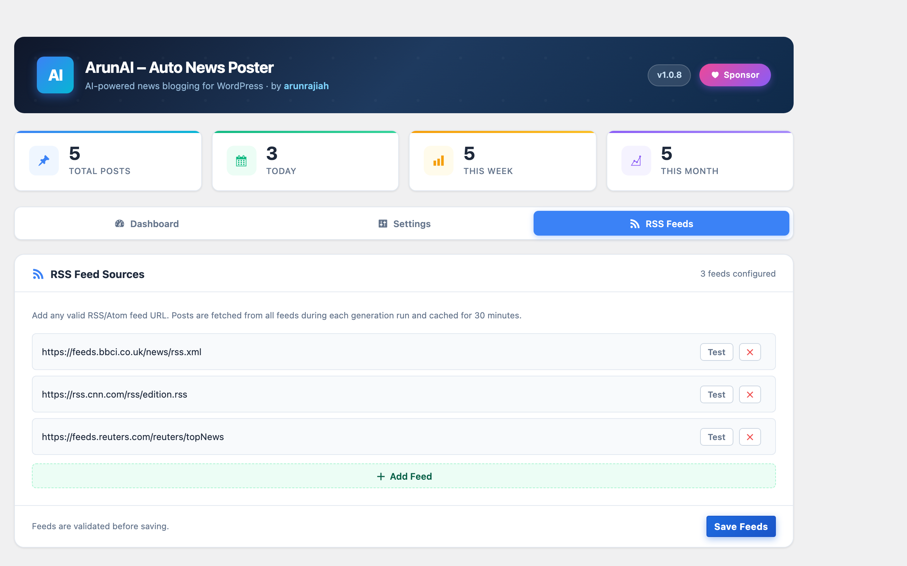

# ArunAI – Auto News Poster


AI-powered WordPress plugin that automatically generates unique blog posts from the latest news using OpenAI, Anthropic Claude, or any OpenAI-compatible API. Supports WP-Cron scheduling, DALL-E 3 featured images, RSS feed management, and AES-256 encrypted API key storage. All features are free — no license key required.

---

## Screenshots

| Dashboard | Settings |
|-----------|----------|
|  |  |

| Scheduling & Save | RSS Feeds |
|-------------------|-----------|
|  |  |

---

## Features

- **Multi-provider AI** — OpenAI GPT, Anthropic Claude, or any OpenAI-compatible custom endpoint (Ollama, LM Studio, OpenRouter)
- **WP-Cron scheduling** — hourly, every 6 hours, twice daily, or daily automatic generation
- **DALL-E 3 featured images** — auto-generate and attach editorial images to every post (OpenAI only)
- **RSS feed management** — add, remove, and test feeds from the settings UI; results cached for 30 minutes
- **Live progress UI** — per-article generation with a progress bar and real-time status
- **Duplicate detection** — already-posted articles are silently skipped via a custom tracking table
- **AES-256 encrypted API keys** — stored encrypted using a per-install key derived from `wp_salt('auth')`
- **Draft-first workflow** — all posts saved as drafts for review before publishing
- **Source attribution** — every post links back to the original news source

---

## Requirements

| Component | Minimum |
|-----------|---------|
| WordPress | 5.1 |
| PHP | 7.4 |
| PHP extensions | `openssl`, `simplexml`, `mbstring` |
| Database | MySQL 5.6 / MariaDB 10.1 |
| AI API key | OpenAI, Anthropic, or compatible |

---

## Installation

**From WordPress Admin (recommended)**
1. Download the zip from the [Releases page](https://github.com/arunrajiah/arunai-auto-news-poster/releases)
2. Go to **Plugins > Add New > Upload Plugin**, select the zip, and activate

**Manual**
1. Upload the `arunai-auto-news-poster` folder to `/wp-content/plugins/`
2. Activate from the **Plugins** screen

**Developer**
```bash
git clone https://github.com/arunrajiah/arunai-auto-news-poster.git
cp -r arunai-auto-news-poster /path/to/wordpress/wp-content/plugins/
```

---

## Configuration

Navigate to **Settings > ArunAI – Auto News Poster** after activation.

| Setting | Description |
|---------|-------------|
| LLM Provider | OpenAI, Anthropic, or Custom API |
| API Key | AES-256-CBC encrypted on save; never shown again |
| Custom API Endpoint | Any OpenAI-compatible URL |
| Custom API Model | Model name sent in the request body |
| Word Count | Short (300–400 w) / Medium (500–600 w) / Long (800–1000 w) |
| Writing Tone | Neutral / Professional / Friendly |
| Post Categories | WordPress categories assigned to generated posts |
| RSS Feed URLs | One URL per row; **Test** button validates before saving |
| Schedule | Disabled / Hourly / Every 6 Hours / Twice Daily / Daily |
| Featured Images | Auto-generate DALL-E 3 images (OpenAI provider only) |

**Getting API Keys**
- **OpenAI** → [platform.openai.com](https://platform.openai.com/) → API Keys
- **Anthropic** → [console.anthropic.com](https://console.anthropic.com/) → API Keys

---

## Usage

### Manual Generation
1. Go to **Settings > ArunAI – Auto News Poster → Dashboard**
2. Click **Generate Posts Now**
3. Articles are fetched from RSS feeds then generated one at a time with a live progress indicator
4. Each post appears in the results list with an Edit link as soon as it is created
5. Review and publish drafts from **Posts > All Posts**

### Automatic Scheduling
1. Go to the **Settings** tab → **Auto-Scheduling**
2. Choose a schedule (Hourly / Every 6 Hours / Twice Daily / Daily)
3. Click **Save Settings** — the WP-Cron event registers immediately
4. The next run time is shown below the schedule selector

> WP-Cron fires on web requests. On low-traffic sites, add a system cron:
> `*/5 * * * * wget -q -O - https://yoursite.com/wp-cron.php?doing_wp_cron >/dev/null 2>&1`

### Featured Images
1. Set **LLM Provider** to **OpenAI** and save a valid API key
2. Enable **Generate DALL-E 3 featured images** in the Featured Images card
3. Every new post gets an AI-generated image at 1792×1024 (~$0.08 USD per image)

---

## Architecture

```
AJAX (admin JS)
  └── AANP_Admin_Settings
        ├── ajax_fetch_articles  →  AANP_News_Fetch::fetch_latest_news()
        └── ajax_generate_single →  AANP_AI_Generator::generate_content()
                                      └── AANP_Post_Creator::create_post()
                                            └── AANP_Image_Generator::generate_and_attach() (optional)

WP-Cron (aanp_scheduled_generation)
  └── AANP_Scheduler::run()  — identical pipeline to manual AJAX flow
```

| File | Class | Purpose |
|------|-------|---------|
| `newsforge-ai-auto-news-poster.php` | `AANP_Plugin` | Bootstrap, constants, DB migrations |
| `includes/class-admin-settings.php` | `AANP_Admin_Settings` | Settings API, AJAX handlers, API-key encryption |
| `includes/class-news-fetch.php` | `AANP_News_Fetch` | RSS/Atom parsing with 30-min transient cache |
| `includes/class-ai-generator.php` | `AANP_AI_Generator` | Prompt building; OpenAI / Anthropic / Custom API calls |
| `includes/class-post-creator.php` | `AANP_Post_Creator` | Draft creation, duplicate detection, stats queries |
| `includes/class-image-generator.php` | `AANP_Image_Generator` | DALL-E 3 generation and media-library attachment |
| `includes/class-scheduler.php` | `AANP_Scheduler` | WP-Cron registration, reschedule on settings save |
| `admin/settings-page.php` | — | Tabbed admin UI template (Dashboard / Settings / RSS Feeds) |

**AJAX generation is two-phase:**
1. `aanp_fetch_articles` — returns up to 30 candidate article objects from RSS feeds
2. `aanp_generate_single` — called once per article sequentially, so the progress bar advances in real time

**Duplicate detection** uses `wp_aanp_generated_posts` (custom table, indexed on `source_url`) with a post-meta fallback for posts created before the table existed.

**API key encryption:** `AES-256-CBC`, key = `substr(hash('sha256', wp_salt('auth')), 0, 32)`, stored in `aanp_settings` WP option.

---

## Security

| Feature | Implementation |
|---------|---------------|
| API key storage | AES-256-CBC encrypted; never echoed back to the page |
| AJAX authentication | `wp_verify_nonce()` on every request |
| Capability check | `manage_options` required for all admin actions |
| SQL | `$wpdb->prepare()` for all parametrised queries |
| Output | `esc_html()`, `esc_attr()`, `esc_url()` throughout |
| Rate limiting | 60-second cooldown transient between manual batches |

---

## Development

```bash
composer install          # install dev dependencies
composer test             # run PHPUnit (requires PHP 8.1+)
composer lint             # run PHPCS (WordPress Coding Standards)
composer lint-fix         # auto-fix violations with phpcbf
docker compose up -d      # start WordPress at http://localhost:8877
```

Plugin settings in Docker: `http://localhost:8877/wp-admin/options-general.php?page=arunai-auto-news-poster`

**CI pipeline** (runs on every push to `main`/`develop`):

| Job | PHP versions | Tool |
|-----|-------------|------|
| PHP Syntax Check | 7.4, 8.0, 8.1, 8.2, 8.3 | `php -l` |
| WordPress Coding Standards | 8.2 | PHPCS + WPCS 3 |
| PHPUnit Tests | 8.1, 8.2, 8.3 | PHPUnit 10 |

---

## Troubleshooting

**Posts not generating** — check the API key, confirm the account has credits, enable `WP_DEBUG_LOG` and look for `AANP:` entries in `wp-content/debug.log`. Use the **Test** button next to each feed to confirm it is reachable.

**Scheduled generation not running** — WP-Cron requires incoming traffic. Verify with `wp cron event list | grep aanp`. Changing the schedule in settings clears the old event and registers a new one.

**Featured images missing** — DALL-E 3 requires the provider to be **OpenAI**. Check the API key has image-generation permissions and look for `AANP_Image_Generator:` log entries.

**Duplicate skipped unexpectedly** — check `wp_aanp_generated_posts` in your database. Delete the row for the source URL to allow re-generation.

---

## Changelog

### 1.0.8
- Renamed plugin to "ArunAI – Auto News Poster" per WordPress.org directory guidelines
- Complete admin UI redesign: dark navy hero, stat cards, tabbed layout (Dashboard / Settings / RSS Feeds), toggle switches, sticky save bar
- All features fully free — removed license-key checks and feature gating
- Fixed Save Settings button visibility (CSS specificity issue with WordPress core)
- Real screenshots added

### 1.0.7
- WP-Cron scheduling (hourly / every 6 h / twice daily / daily)
- DALL-E 3 featured image generation (OpenAI, 1792×1024)
- New classes: `AANP_Scheduler`, `AANP_Image_Generator`
- 39 PHPUnit tests

### 1.0.6
- Fixed all WordPress Plugin Check errors (i18n, escaping, translators comments)
- Removed inline styles; moved to `admin.css`

### 1.0.5
- AES-256-CBC API key encryption
- 60-second rate limiting
- Two-phase AJAX generation with live progress bar
- Per-feed Test button
- Custom API endpoint support
- Duplicate detection via tracking table

### 1.0.0
- Initial release

---

## License

GPL v2 or later — see [gnu.org/licenses/gpl-2.0](https://www.gnu.org/licenses/gpl-2.0.html).

**Author:** [Arun Rajiah](https://github.com/arunrajiah) · [Issues](https://github.com/arunrajiah/arunai-auto-news-poster/issues) · [WordPress.org](https://wordpress.org/plugins/arunai-auto-news-poster/)
